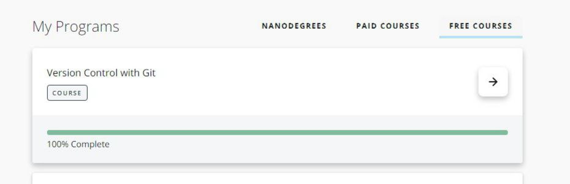
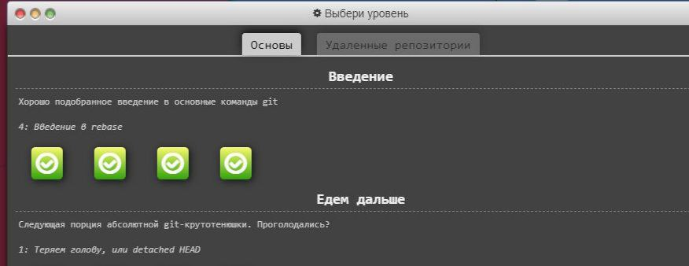
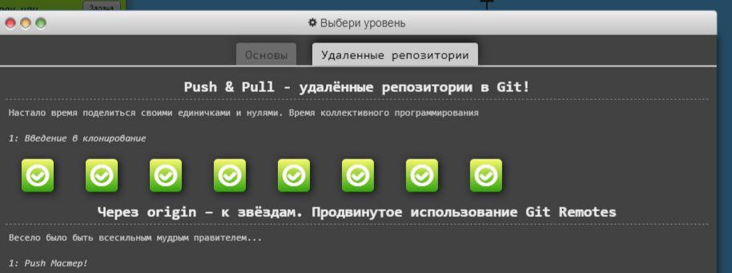
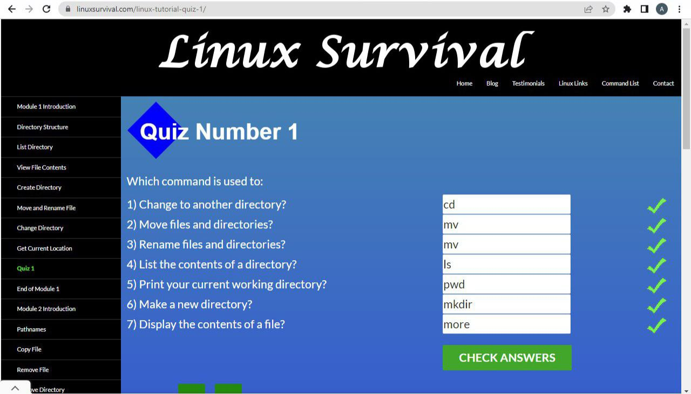
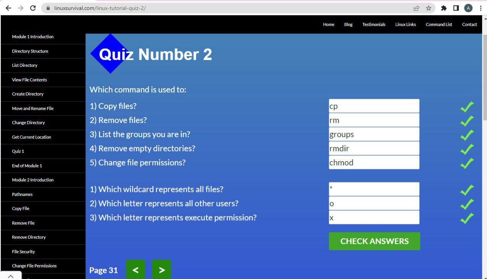
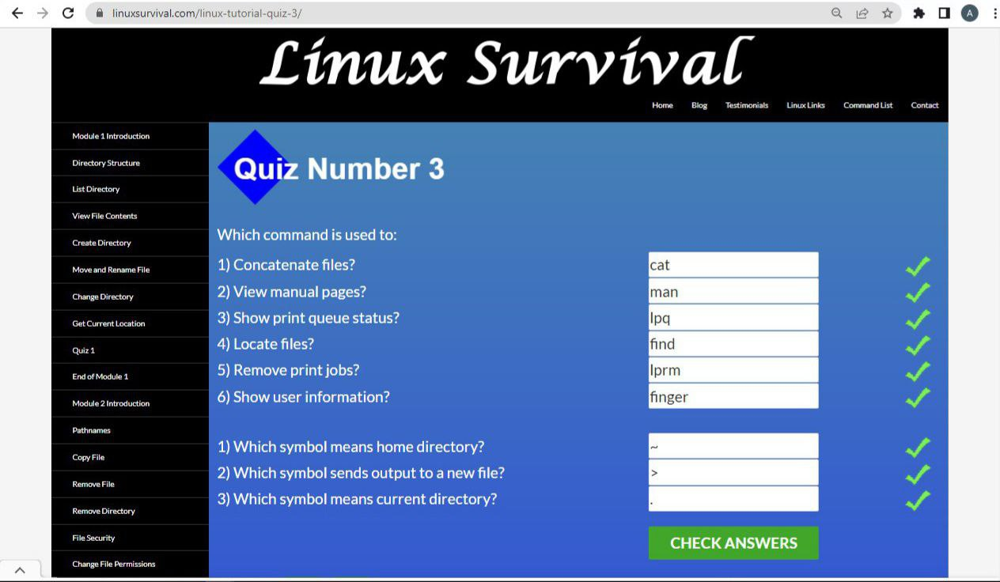
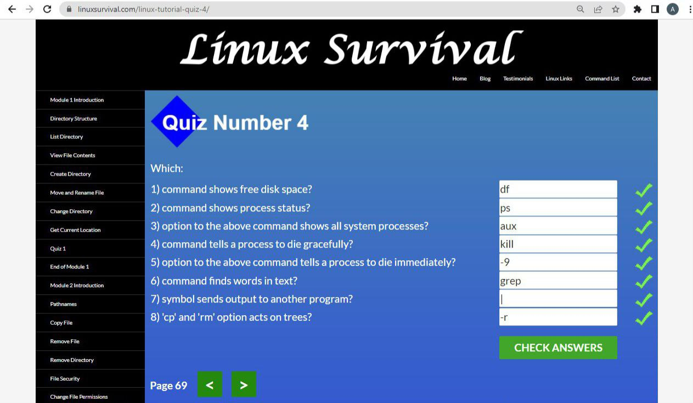

# kottans-frontend
## Git та GitHub
Пройшла онлайн курс Udaсity Version сontrol with Git. До цього все робила через GitHub Desktop. Надалі буд використовувати git.
Цікавий курс, плюсом було додаткове вивчення англійської мови. Але в нього є великий мінус - курс зараховується навіть без виконаних тестових вправ.
Тому, як для отримання знань - підходить, а для контроля - не дуже)

------

## Linux CLI, and HTTP
Курс Linux Survival видався цікавим і легким для сприйняття, хоча з коммандами в Linux
до цього не стикалась. Зручно та швидко можна отримати інформацію, знаючи основні команди. 

Прочитала двічі цю статтю. Cприймається важко, може  тому що немає практичної частини. Можна повернутися до статті у разі потреби у майбутньому. 

[Cтаття_1](https://code.tutsplus.com/uk/tutorials/http-the-protocol-every-web-developer-must-know-part-1--net-31177 "HTTP: Протокол, який повинен розуміти кожний веб-розробник - Частина 1")
[Cтаття_2](https://code.tutsplus.com/uk/tutorials/http-the-protocol-every-web-developer-must-know-part-2--net-31155 "HTTP: Протокол, який повинен розуміти кожний веб-розробник - Частина 2")

