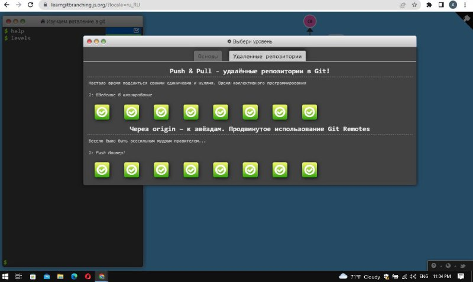
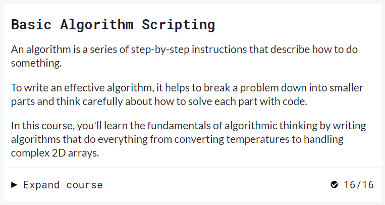

# kottans-frontend
_______
## Git та GitHub
Пройшла онлайн курс Udaсity Version сontrol with Git. До цього все робила через GitHub Desktop. Надалі буд використовувати git.
Цікавий курс, плюсом було додаткове вивчення англійської мови. Але в нього є великий мінус - курс зараховується навіть без виконаних тестових вправ.
Тому, як для отримання знань - підходить, а для контроля - не дуже)

_______

## Linux CLI, and HTTP
Курс Linux Survival видався цікавим і легким для сприйняття, хоча з командами в Linux
до цього не стикалась. Зручно та швидко можна отримати інформацію, знаючи основні команди. 

Прочитала двічі цю статтю. Cприймається важко, може  тому що немає практичної частини. Можна повернутися до статті у разі потреби у майбутньому. 

1. [HTTP: Протокол, який повинен розуміти кожний веб-розробник - Частина 1](https://code.tutsplus.com/uk/tutorials/http-the-protocol-every-web-developer-must-know-part-1--net-31177 "HTTP: Протокол, який повинен розуміти кожний веб-розробник - Частина 1")

2. [HTTP: Протокол, який повинен розуміти кожний веб-розробник - Частина 2](https://code.tutsplus.com/uk/tutorials/http-the-protocol-every-web-developer-must-know-part-2--net-31155 "HTTP: Протокол, який повинен розуміти кожний веб-розробник - Частина 2")
________

## Git Collaboration
Багато цікавої нової інформації, здивувало, що її дуже багато))))
Зрозуміла, що треба більше практики, щоб закріпити ці знання.

Тренажер [Learn Git Branching](https://learngitbranching.js.org/?locale=uk- "learngitbranching.js.org") можна проходити декілька разів, допомагає структурувати все, що вивчив.

_________

## Intro to HTML and CSS

Майже все, що було в чий частині я вже знала і застосовувала до цього. Єдиний момент - це позиціонування. Т.я. англійською мовою ця тема видалась важкою ( саме переклад), то додатково подивилась ютуб "Фрілансер по життю". Звичайно, знання англійської не вистачає для швидкого розуміння технічного тексту. треба піднягнути)

__________

## Responsive Web Design

Для мене Flexbox і Grid Layout були повністю нові теми, але цікаві і які мають важливе практичне значення. 
Ігри Flexbox Froggy і Grid Garden пояснюють для новачків, як я, на простих прикладах, де будуть розміщуватися елементи в залежності від різних властивостей. Буду використовувати ці знання 100%. 

___________

## HTML & CSS Practice

This is my first html&css practice. Honestly It was hard for me. I learned how to use checkboxes to make elements disappear and appear, used flexbox, deepened my knowledge of pseudo-selectors. It was an incredible experience. Thanks  mentors and other students who helped.

[demo](https://annymax.github.io/HTML-CSS-Practice/ "demo")
 
[code base](https://github.com/annymax/HTML-CSS-Practice "code base")

___________

## JS Basics

The freeCodeCamp exercises were very useful. All modules were either repetition or easy to understand, except Algorithm Scripting Challenges. These tasks could not be solved without prompts. I will use methods like replace, concat, indexOf, slice, split, etc.

